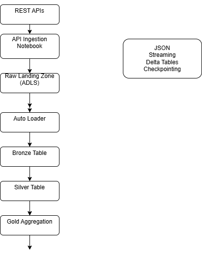

# Metadata-Driven API Ingestion Platform on Azure Databricks

This project demonstrates an **enterprise-grade metadata-driven data ingestion platform** built on **Azure Databricks, ADLS Gen2, Delta Lake, and Structured Streaming**.

The platform dynamically ingests multiple REST APIs using a **configuration-driven architecture**, automatically lands raw API data into **ADLS Gen2**, processes it through the **Medallion Architecture (Bronze → Silver → Gold)**, and produces **analytics-ready datasets for downstream BI, ML, and GenAI use cases**.

This design follows **modern lakehouse architecture patterns used in large-scale enterprise data platforms**.

# Platform Architecture

# Project Highlights

• Built an **enterprise-grade metadata-driven API ingestion framework** on Azure Databricks  
• Implemented **Auto Loader-based incremental ingestion** from ADLS Gen2  
• Designed **Lakehouse Medallion architecture (Bronze → Silver → Gold)**  
• Developed **dynamic REST API ingestion engine with pagination support**  
• Implemented **Structured Streaming pipelines with checkpointing**  
• Built **watermark-based tumbling window aggregations for analytics**  
• Designed **configuration-driven pipelines enabling onboarding of new APIs without code changes**

This project demonstrates real-world **Data Platform Engineering patterns used in large-scale Databricks deployments**.

# Problem Statement

Modern organizations integrate with numerous external systems such as:

- CRM platforms
- Financial systems
- Customer engagement platforms
- SaaS APIs
- Payment systems

Traditional ingestion pipelines are often:

- Hard-coded
- Difficult to scale
- Difficult to maintain
- Difficult to secure
- Difficult to onboard new APIs

Every new API usually requires **pipeline code changes**, which increases operational overhead.

This project solves that problem using a **metadata-driven ingestion framework** where new APIs can be onboarded **by updating configuration metadata instead of modifying pipeline code**.

---

# Architecture Overview

The platform is designed using the **Lakehouse Medallion Architecture**:

Raw API Data → Bronze → Silver → Gold

Each layer has a clear responsibility for **data reliability, governance, and scalability**.

---

# Architecture Components

## Metadata Configuration Layer

The platform stores API ingestion configuration in a **metadata table**.

Configuration includes:

- API name
- Base URL
- Pagination type
- Page size
- Authentication secret scope
- Target bronze table
- Active flag

This enables **dynamic API ingestion without changing pipeline logic**.

---

## API Ingestion Engine

A Databricks notebook dynamically reads the configuration metadata and performs:

- API authentication using **Databricks Secret Scopes**
- Pagination handling
- Data extraction from REST APIs
- Writing raw JSON responses to **ADLS Gen2 landing zone**

This notebook acts as a **generic API ingestion framework**.

---

## Raw Landing Zone (ADLS Gen2)

All API responses are stored as **raw JSON files** in Azure Data Lake Storage Gen2.

Example structure:
/raw/api/customer/2026/03/10/10/customer_api_20260310_100000.json

Benefits:

- Immutable raw storage
- Full data replay capability
- Audit and lineage tracking
- Decoupled ingestion and processing layers

---

## Bronze Layer — Auto Loader

Databricks **Auto Loader** incrementally processes JSON files from the landing zone.

Capabilities:

- Schema inference
- Schema evolution
- Incremental file ingestion
- Exactly-once processing
- Streaming checkpointing

Bronze tables store **raw structured API data** in Delta format.

---

## Silver Layer — Data Cleaning & Standardization

The Silver layer performs **streaming transformations** including:

- Data validation
- Null handling
- Schema normalization
- Data type standardization
- Deduplication

Only **clean and trusted data** is written into Silver tables.

---

## Gold Layer — Analytics Aggregation

Gold tables produce **analytics-ready datasets**.

Streaming analytics features include:

- Watermarking
- Tumbling window aggregation
- Incremental updates

These datasets can power:

- BI dashboards
- Machine learning pipelines
- GenAI feature stores
- downstream applications

---

# Key Features

✔ Metadata-driven ingestion architecture  
✔ Dynamic onboarding of new APIs  
✔ Secure authentication via Databricks Secret Scopes  
✔ Pagination-aware ingestion engine  
✔ Raw immutable landing zone in ADLS Gen2  
✔ Incremental ingestion using Auto Loader  
✔ Lakehouse Medallion architecture implementation  
✔ Streaming transformations with Structured Streaming  
✔ Watermark-based aggregations for analytics  
✔ Enterprise-scale pipeline design

---

# Repository Structure
databricks-metadata-driven-api-ingestion-platform

architecture/
platform_architecture.png

config/
api_metadata_config.json

mock_api/
mock_api_server.py

notebooks/
01_metadata_config_table.py
02_api_to_json_ingestion.py
03_bronze_autoloader.py
04_silver_stream_cleaning.py
05_gold_window_aggregation.py
06_genai_analytics.py
README.md

---

# Technologies Used

- Azure Databricks
- Delta Lake
- Auto Loader
- Structured Streaming
- Azure Data Lake Storage Gen2
- Python
- REST APIs
- Databricks Secret Scopes
- Lakehouse Architecture

---

# Future Enhancements

Potential improvements include:

- Delta Live Tables (DLT) pipeline implementation
- CI/CD deployment using Databricks Asset Bundles
- Data quality monitoring framework
- Pipeline observability dashboards
- Data lineage integration
- GenAI-powered metadata intelligence assistant

---

# Author

**Karan Singh Navalur**

Senior Databricks Data Engineer | Generative AI Engineer  
Specializing in:

- Databricks Lakehouse Architecture
- Data Platform Engineering
- Streaming Data Pipelines
- Generative AI Platforms
- Metadata-driven Data Systems
